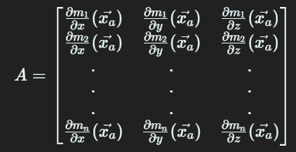

# Kalman Filter

This is a project that demonstrates the use of a Kalman filter for estimating the position of a aircraft navigating through N receivers. The data is visualized using TypeScript and PlotyJs.

## Installation

To get started, clone the repository:

```bash
git clone https://github.com/kyzinatra/KalmanFilter.git
cd KalmanFilter
```

Then install the dependencies:

```bash
npm install
```

## Usage

To run the project, use the following command:

```bash
npm run dev
```

This will start the development server, and you can access the project by opening your web browser and navigating to http://localhost:5173.

## Brief Codebase Information

The `src/models` folder contains classes of physical models. So the navigation class is responsible for the join to work of the aircraft and receivers. It stores instances of all receivers and the aircraft. It also creates them and initializes the sending of signals to the receivers by the `makeCheck` method. After the calculation of positions occurs in the findCoord method. We then calculate the closed solution and use it as the initial approximation for the least squares method. Than data will be displayed on the screen.

All utility classes for rendering and math calculations are located in `src/models/utils`. The `CoordsCalc` class computes the solutions reffered earlier. This folder also stores the implementation of the matrix and vector.
Start tracking is in `src/utils/startDetection`. The detection function initializes the distribution of signals to receivers and then starts the calculation of coordinates and draws the result. It also runs the `Aircraft.move()` function to move the aircraft through space.

By default, 12 receivers and a aircraft are drawn. All other files are needed for the UI and are not directly involved in the modeling. In the main part there are 3 graphs that represents the real position of the aircraft, obtained using the least squares method and using the Kalman filter.

The klaman filter is in the file `src/models/utls/Filter.ts`. It is a general filter algorithm that needs to be passed a matrix before running. They are created in a file `src/utls/kalmanMatrices.ts`

## Signal generation

To freely receive and process signals a `Navigation` class was created, whitch stores and uses all instances of the `Aircraft` and `Receiver` classes. This class implements the `makeCheck()` method to send a signal from the aircraft to receivers. To do this, there is a `getLightDelay()` method on the aircraft, which returns the delay that is necessary for the light to go from the aircraft to the receiver. After this time is added to the current time and sent to receivers. After this moment, nowhere else possible to find out the time it took the signal to reach the receivers. In the `findCord()` method (which will be discussed later) we only have the exact position of each receivers and TOA (Time of signal arrival). We need to calculate TDOA and aircraft position.

`findCord()` method simply run all methods from `CoordsCalc` class and return result to the main process, which print it on the screen in `src/utils/detection.ts`.

## Methods

### Algorithms for Closed Solution

> The solutions presented in this section are mathematically exact, which means that they use algebraic approaches to solve the problem of hyperbolic positioning. Basically, the problem can be defined by the following system of equations which is set up by writing down equation for different stations [[1]](#source):

$c(t_i - t_e) = \sqrt{(x_i - x)^2 + (y_i - y)^2 + (z_i - z)^2}$

Where is $t_i$ is TOA (Time of signal arrival) and $t_e$ is TOE (Time of signal emission).
Since we have 3-dimensional case we need four equations to solve the problem. (`x`, `y`, `z` and $t_e$)

### Bancroft's Algorithm

The calculations starts with some equation transformation. First of all, we square the equation:

$с^2 (t_i - t_e)^2 = (x_i - x)^2 + (y^i - y)^2 + (z_i - z)^2$

$2(x_i x + y_i y - c^2 t_i t_e) = x^2 + y^2 - c^2 t_e^2 + x_i^2 + y_i^2 - c^2 t_i^2$

It makes no sense to show all the transformations and mathematical calculations there. You can see it here [[1]](#source). I'll show the result and move on the implementation.


To implement this to code, I created the `Vector` and `Matrix` classes.

`Vector` class have a usual methods such as `mul()`, `sub()`, `add()`. You can multiply `Vector` by `Vector` or `Number`. You can see the implementation in the `./src/modules/Vector.ts` file.

Next, I created a `Matrix` class for my tasks. I have 3 different methods for multiplying by a scalar, a vector and another matrix, methods have also been made to calculate the determinant in `O(n^3)` and simply matrix invert by adding an identity matrix on the right. All these methods allowed me feel free to work with the formulas above and create the `getClosedSolution()` method, which implements all these mathematical calculations.

### Applied Adjustment Theory in Multilateration

> These equations can be transformed into the following form and, for the sake of simplicity, we newly replace the time variables by the so-called pseudo ranges [[1]](#source)

$c(t_i - t_j) = \sqrt{(x_i - x)^2 + (y_i - y)^2 + (z_i - z)^2} - \sqrt{(x_j - x)^2 + (y_j - y)^2 + (z_j - z)^2} $

1. We have to calculate the following derivatives to perform the tailor expansion

$\frac{\partial m_i}{\partial x}=\frac{x_j-x}{\sqrt{\left(x_j-x\right)^2+\left(y_j-y\right)^2+\left(z_j-z\right)^2}}-\frac{x_i-x}{\sqrt{\left(x_i-x\right)^2+\left(y_i-y\right)^2+\left(z_i-z\right)^2}}$

$\frac{\partial m_i}{\partial y}=\frac{y_j-y}{\sqrt{\left(x_j-x\right)^2+\left(y_j-y\right)^2+\left(z_j-z\right)^2}}-\frac{y_i-y}{\sqrt{\left(x_i-x\right)^2+\left(y_i-y\right)^2+\left(z_i-z\right)^2}}$

$\frac{\partial m_i}{\partial z}=\frac{z_j-z}{\sqrt{\left(x_j-x\right)^2+\left(y_j-y\right)^2+\left(z_j-z\right)^2}}-\frac{z_i-z}{\sqrt{\left(x_i-x\right)^2+\left(y_i-y\right)^2+\left(z_i-z\right)^2}}$

$d\vec{m} = Ad\vec{x}$

where



$d\vec{m} = \vec{m} - \vec{m}(\vec{x_a})$

$d\vec{x} = \vec{x} - \vec{x_a}$

### Steps to calculate solution

1. Putting up the system matrix A in the point $\vec{x_a}$.
1. Calculate $d\vec{x}$
1. Calculate $d\vec{x}$ using these formulas:

$d\vec{x} = (A^TPA)^{-1}A^TPd\vec{m}$

$\vec{x} = \vec{x_a} + d\vec{x}$

4. Repeat from step 1, but replacing $\vec{x_a}$ by the $\vec{x}$

## Kalman Filter

The Kalman filter is based on its classical representation [[3]](#source). Next, we present the formulas for its implementation. First of all, you have to define the state vector. In our case, it contains the position, velocity, and acceleration at time $t$:

$\vec{x} = [p_x, p_y, p_z, u_x, u_y, u_z, a_x, a_y, a_z]$

The second, we have to define

- $F$ — process evolution Matrix (9x9 in our case)
- $H$ — observation model Matrix (3x9 in our case)
- $Q$ — process noise covariance Matrix (9x9 in our case)
- $R$ — observation noise covariance Matrix (3x3 in our case)
- $P$ — estimation error covariance Matrix (9x9 in our case)

Here they are in order:


$P = I\sigma^2$

$R = I\sigma^2$

After we have determined all the necessary metrics, we will describe the algorithm of the Kalman filter itself. This algorithm works iteratively and at each step receives a new estimate from the previous one.

1. Predict step

$\bar x_k = F_kx_{k-1}$

$\bar P_k = F_kP_{k-1}F^T_k + Q_k$

2. Update

$\tilde y = z_k - H_k \bar x$

$K_k = \bar P_k H^T_k (H_k \bar P_k H^T_k + R_k)^{-1}$

$x_k = \bar x_k + K_k\tilde y_k$

$P_k = \bar P_k - K_kH_k\bar P_k$

## Source

1. [Elaboration of Methods and Algorithms for Passive Aircraft and Vehicle Detection over Time of Signal Arrival Differences](https://diglib.tugraz.at/download.php?id=576a75430e75f&location=browse)
2. [Pseudo-range multilateration (Wikipedia)](https://en.wikipedia.org/wiki/Pseudo-range_multilateration)
3. [Kalman filter (Wikipedia)](https://en.wikipedia.org/wiki/Kalman_filter)
4. [Kalman R.E. "New Results in Linear Filtering and Prediction Theory"](https://web.archive.org/web/20080529105724/http://www.elo.utfsm.cl/~ipd481/Papers%20varios/kalman1960.pdf)

## Credits

This project was created by [kyzinatra](https://github.com/kyzinatra) and is licensed under the [MIT License](https://en.wikipedia.org/wiki/MIT_License).
